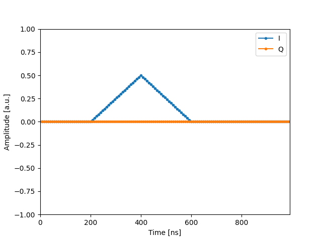
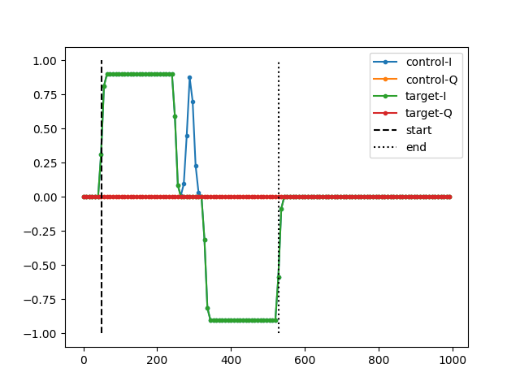
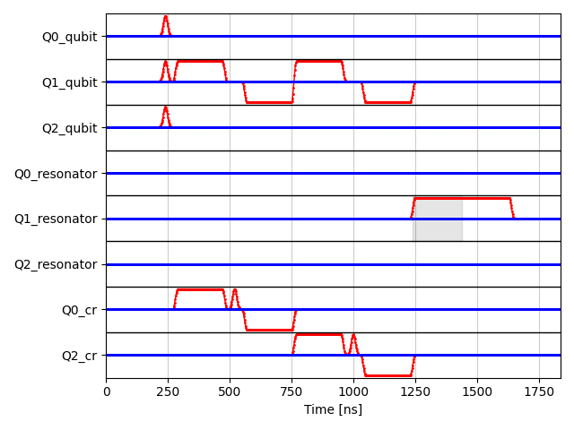

# MT Pulse

Pulse synthesizer for microwave experiments

## Overview

This library provides pulse-definition with the following features.

- Preset pulses (blank, flattop, flattop_cosrise, gaussian, gaussian_drag)
- User-custom pulses can be generated with text serialization
- Parametric treatment of pulse shapes
- Convert pulses to paramter-fixed form; data-point array or numpy time-function

## Examples

### Serializable pulse expression
- Example
```python
import json
from mt_pulse import Shape
from mt_pulse.preset_pulse import gaussian_drag

# create pulse instances with equations
pulse = gaussian_drag()
print("expression\n", pulse.shape_expr, "\n")
print("symbols\n", pulse.get_symbol_name_set(), "\n")

# can be saved as json
json_str = json.dumps(pulse.to_json_dict())
pulse_load = Shape.from_json_dict(json.loads(json_str))
print("json\n", json_str, "\n")
assert(json_str == json.dumps(pulse_load.to_json_dict()))
```

- Output
```python
expression
 amplitude*(5.54517744447956*I*drag*t*exp(-2.77258872223978*t**2/width**2)/width**2 + exp(-2.77258872223978*t**2/width**2))*exp(1.0*I*phase) 

symbols
 {'amplitude', 'width', 'phase', 'drag', 't'}

json
 {"name": "gaussian_drag", "shape_expr": "Mul(Symbol('amplitude'), Add(Mul(Float('5.5451774444795623', precision=53), I, Symbol('drag'), Symbol('t'), Pow(Symbol('width'), Integer(-2)), exp(Mul(Integer(-1), Float('2.7725887222397811', precision=53), Pow(Symbol('t'), Integer(2)), Pow(Symbol('width'), Integer(-2))))), exp(Mul(Integer(-1), Float('2.7725887222397811', precision=53), Pow(Symbol('t'), Integer(2)), Pow(Symbol('width'), Integer(-2))))), exp(Mul(Float('1.0', precision=53), I, Symbol('phase'))))", "progress_time_ns": "Float('0.0', precision=53)", "pulse_start_time_ns": "Mul(Float('4.0', precision=53), Symbol('width'))", "pulse_end_time_ns": "Mul(Float('4.0', precision=53), Symbol('width'))"}
```


### Instantiate pulse
- Example
```python
import numpy as np
import matplotlib.pyplot as plt
from mt_pulse.preset_pulse import gaussian_drag

pulse = gaussian_drag()

# create time slots
cursor = 400
time_slots = np.arange(0, 1000, 8)

# instantiate waveform
param = {"width": 200, "amplitude": 0.5, "drag": 40, "phase": np.pi/10}
pulse_func = pulse.get_time_function(param)
pulse_waveform = pulse_func(time_slots-cursor)

# plot waveform
plt.plot(time_slots, np.real(pulse_waveform), ".-", label=f"I")
plt.plot(time_slots, np.imag(pulse_waveform), ".-", label=f"Q")
plt.xlim(np.min(time_slots), np.max(time_slots))
plt.ylim(-1, 1)
plt.xlabel("Time [ns]")
plt.ylabel("Amplitude [a.u.]")
plt.legend()
plt.show()
```

- Output


### Create User's custom pulse
- Example
```python
import numpy as np
import json
import matplotlib.pyplot as plt
import sympy as sp
from mt_pulse.shape import Shape

# add user's custom shape
t, width, amplitude = sp.symbols(["t", "width", "amplitude"])
shape = sp.Piecewise(
    (amplitude * (1 - sp.Abs(t) / width), sp.And(-width < t, t < width)),
    (0, True),
)
shape = Shape(
    name="triangle",
    shape_expr=shape,
    progress_time_ns=sp.Float(0),
)

# create time slots
cursor = 400
time_slots = np.arange(0, 1000, 8)

# instantiate waveform
param = {"width": 200, "amplitude": 0.5}
shape_func = shape.get_function(param)
shape_waveform = shape_func(time_slots - cursor)

# plot waveform
plt.plot(time_slots, np.real(shape_waveform), ".-", label="I")
plt.plot(time_slots, np.imag(shape_waveform), ".-", label="Q")
plt.xlim(np.min(time_slots), np.max(time_slots))
plt.ylim(-1, 1)
plt.xlabel("Time [ns]")
plt.ylabel("Amplitude [a.u.]")
plt.legend()
plt.show()
```

- Output




### Create Composite Pulse

```python
import numpy as np
import matplotlib.pyplot as plt
from mt_pulse.pulse_preset import get_preset_pulse_library

pulse_lib = get_preset_pulse_library()

# get parameter config of sequence, which contains correspondence between key and default values
config = pulse_lib.get_config("TPCX")

# create cursor and timeslots
time_slots = np.arange(0, 1000, 8)
cursor = initial_cursor = 50

# generate waveform of pulse with different config
pulse_waveform, duration = pulse_lib.get_waveform("TPCX", time_slots, cursor, config)
cursor += duration

# plot waveform
plt.plot(time_slots, np.real(pulse_waveform["control"]), ".-", label="control-I")
plt.plot(time_slots, np.imag(pulse_waveform["control"]), ".-", label="control-Q")
plt.plot(time_slots, np.real(pulse_waveform["target"]), ".-", label="target-I")
plt.plot(time_slots, np.imag(pulse_waveform["target"]), ".-", label="target-Q")
plt.plot([initial_cursor, initial_cursor], [-1, 1], "--", c="black", label="start")
plt.plot([cursor, cursor], [-1, 1], ":", c="black", label="end")
plt.legend()
plt.show()
```

- Output



### Create sequence

```python
import json
from pprint import pprint
import numpy as np
import matplotlib.pyplot as plt
from mt_pulse.pulse_preset import get_preset_pulse_library
from mt_pulse.sequence import Sequence, SequenceConfig

pulse_lib = get_preset_pulse_library()

# show description of registered sequence
config_desc = pulse_lib.get_description()
pprint(config_desc)

# qubit sequence
seq = Sequence(pulse_lib)
seq.add_channel("Q0_qubit", channel_group="Q0")
seq.add_channel("Q1_qubit", channel_group="Q1")
seq.add_channel("Q2_qubit", channel_group="Q2")
seq.add_channel("Q0_resonator", channel_group="Q0")
seq.add_channel("Q1_resonator", channel_group="Q1")
seq.add_channel("Q2_resonator", channel_group="Q2")
seq.add_channel("Q0_cr", channel_group="Q0")
seq.add_channel("Q2_cr", channel_group="Q2")

seq.add_blank_command(["Q0_qubit"], 200)
seq.add_synchronize_all_command()
seq.add_pulse("HPI", {"qubit": "Q0_qubit"})
seq.add_pulse("HPI", {"qubit": "Q1_qubit"})
seq.add_pulse("HPI", {"qubit": "Q2_qubit"})
seq.add_synchronize_command(["Q0_qubit", "Q1_qubit", "Q2_qubit"])
seq.add_pulse("TPCX", {"control": "Q0_cr", "target": "Q1_qubit"})
seq.add_pulse("TPCX", {"control": "Q2_cr", "target": "Q1_qubit"})
seq.add_synchronize_command(["Q1_qubit", "Q1_resonator"])
seq.add_capture_command(
    [
        "Q1_resonator",
    ]
)
seq.add_pulse("MEAS", {"resonator": "Q1_resonator"})
seq.add_synchronize_all_command()
seq.add_blank_command(["Q1_resonator"], 200)
seq.add_synchronize_all_command()

# sequence is json serializable
dump_str = json.dumps(seq.to_json_dict())
seq = Sequence.from_json_dict(json.loads(dump_str))
dump_str2 = json.dumps(seq.to_json_dict())
assert dump_str == dump_str2

# get variables of Sequence
config = seq.get_config()
pprint(config)

# sequence config is json serializable
dump_str = json.dumps(config.to_json_dict())
config = SequenceConfig.from_json_dict(json.loads(dump_str))
dump_str2 = json.dumps(config.to_json_dict())
assert dump_str == dump_str2

# get sequence length
capture_duration = 200
length = seq.get_duration(config, capture_duration)
delta_time = 2
time_slots = np.arange(0, length, delta_time)

# get waveform
waveform_dict, capture_point = seq.get_waveform(time_slots, config)
idx = 0
for channel in waveform_dict:
    waveform = waveform_dict[channel]
    plt.plot(time_slots, -2 * idx + np.real(waveform), ".-", color="r", markersize=2, linewidth=1)
    plt.plot(time_slots, -2 * idx + np.imag(waveform), ".-", color="b", markersize=2, linewidth=1)
    if idx != 0:
        plt.plot(
            [min(time_slots), max(time_slots)], [-2 * idx + 1, -2 * idx + 1], "-", c="black", alpha=1.0, linewidth=1
        )

    point_list = capture_point[channel]
    for point in point_list:
        plt.fill_between(
            [point, point + capture_duration],
            [-2 * idx + 1, -2 * idx + 1],
            y2=[-2 * idx - 1, -2 * idx - 1],
            color="black",
            alpha=0.1,
        )
    idx += 1
plt.xlim(min(time_slots), max(time_slots))
plt.ylim(-2 * idx + 1, 1)
plt.yticks(-np.arange(len(waveform_dict.keys())) * 2, waveform_dict.keys())
plt.grid(which="major", color="black", linestyle="-", alpha=0.2)
plt.grid(which="minor", color="black", linestyle="-", alpha=0.2)
plt.xlabel("Time [ns]")
plt.tight_layout()
plt.show()
```

- Output



