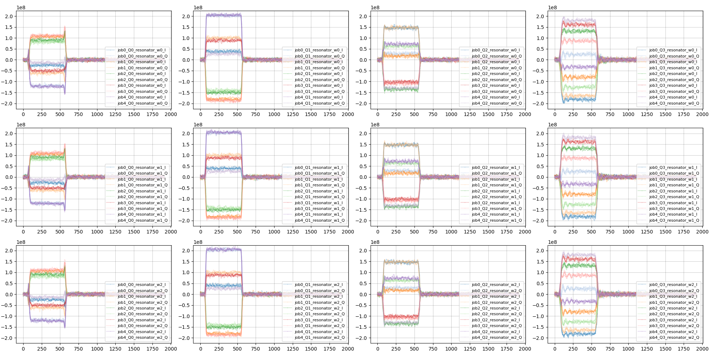

# mt_quel_meas

Interfaces to generate abstract experiment jobs and convert it to experimental interfaces

## Overview

The expected procedure for experiment is as follows.

1. Create `ParametricJob` with information such as number of target qubits
2. Configure frequencies, sequences, averaging windows, and common settings to create a `Job`.
3. Create binding from abstract job sequences to measurement instrument ports, `AssignmentQuel`
4. Create concrete job dependent object `JobQubeServer` with from `Job` and `AssignmentQuel`
5. Launch `JobExecutorQubeServer` and put `JobQubeServer` and obtain `ResultQubeServer`
6. Convert `ResultQubeServer` to `Result` using `Job`, `JobQubeServer`, and `AssignmentQuel`

- If you replace `QubeServer` to `Quelware`
  - Create a function to create `JobQuelware` from `Job` and `AssignmentQuel`
  - Create `JobExecutorQuelware` and `ResultQuelware` to communicate QuEL via quelware
  - Create a fuction to convert `ResultQuelware` to `Result`

- If you replace QuEL with other instruments, nammed Hoge.
  - Create a function to binding abstract job to actual machine to create `HogeAssignment`
  - Create `JobExecutorHoge`, `JobHoge`, `ResultHoge` according to the input and output of interfaces of `Hoge`
  - Create a function to convert `ResultHoge` to `Result`

## Examples

### Serializable pulse expression
- Example (See `test.py` for full code)

```python
# config
target_qubit_list = [0, 1, 2, 3]
num_qubit = 16
num_window = 3
num_job = 5
num_shot = 10
flag_average_shots = False
flag_average_waveform = False

# create template
num_averageing_window_sample = get_available_averaging_window_sample(CONST_QuEL1SE_LOW_FREQ)
enable_CR = True
(
    sequence,
    channel_to_role,
    channel_to_qubit_index_list,
    channel_to_frequency,
    channel_to_frequency_shift,
    channel_to_frequency_reference,
    channel_to_averaging_window,
) = generate_template(num_qubit, target_qubit_list, num_averageing_window_sample, enable_CR)

# create translator
quel_assignment = assign_to_quel(
    channel_to_role,
    channel_to_qubit_index_list,
    channel_to_frequency_reference,
    wiring_dict_16Q,
    CONST_QuEL1SE_LOW_FREQ,
)

# set frequency
for i, q in enumerate(target_qubit_list):
    freq = (4.0 + 0.1 * i) * tunits.units.GHz
    if i != 0:
        freq += 0.2 * tunits.units.GHz
    channel_to_frequency[f"Q{q}_qubit"] = freq
    channel_to_frequency[f"Q{q}_resonator"] = (6.1 + 0.1 * i) * tunits.units.GHz

# create seqeunce
sequence.add_blank_command([f"Q{target_qubit_list[0]}_resonator"], 100)
sequence.add_synchronize_all_command()
for _ in range(num_window):
    sequence.add_capture_command([f"Q{q}_resonator" for q in target_qubit_list])
    for q in target_qubit_list:
        sequence.add_pulse("FLATTOP", {"channel": f"Q{q}_resonator"})
        sequence.add_blank_command([f"Q{q}_resonator"], 2500)
    sequence.add_synchronize_all_command()

# create seqeunce config
sequence_config = sequence.get_config()
for q in target_qubit_list:
    sequence_config.get_parameter((f"Q{q}",))["FLATTOP"]["flattop_width"] = 500
    sequence_config.get_parameter((f"Q{q}",))["FLATTOP"]["flattop_amplitude"] = 0.24
    sequence_config.get_parameter((f"Q{q}",))["FLATTOP"]["flattop_phase"] = np.pi * (1.01 + 0.1)

# create acquisition config
acquisition_config = AcquisitionConfig()
acquisition_config.flag_average_shots = flag_average_shots
acquisition_config.flag_average_waveform = flag_average_waveform
acquisition_config.num_shot = num_shot
acquisition_config.acquisition_timeout = 3 * tunits.units.s
acquisition_config.acquisition_delay = 1000 * tunits.units.ns

# start executor
executor = JobExecutorQubeServer()

plt.figure(figsize=(20, 10))
for job_idx in range(num_job):

    # modify parameters for job
    for q in target_qubit_list:
        param = sequence_config.get_parameter((f"Q{q}",))
        phase = np.pi * (0.44) + (2 * np.pi / num_job) * job_idx
        param["FLATTOP"]["flattop_phase"] = phase

    # create job
    job = Job(
        sequence,
        sequence_config,
        channel_to_frequency,
        channel_to_frequency_shift,
        channel_to_averaging_window,
        acquisition_config,
    )

    # bind job to qube server
    job_qube_server = translate_job_qube_server(job, quel_assignment)

    # do measurement
    result_qube_server = executor.do_measurement(job_qube_server)

    # extract data by binding information
    result = extract_dataset(job, job_qube_server, quel_assignment, result_qube_server)

    # plot result
    if acquisition_config.flag_average_shots:
        if acquisition_config.flag_average_waveform:
            plot_both_average(result, job_idx)
        else:
            plot_average_shot(result, job_idx)
    else:
        if acquisition_config.flag_average_waveform:
            plot_average_waveform(result, job_idx)
        else:
            plot_no_average(result, job_idx)

plt.tight_layout()
plt.show()
```

- Output

```
INFO    : 2025-11-28 05:11:13,355 : job translate | awg channel assign | seq-ch: Q0_qubit - awg-ch: quel1se-2-01-control_7-AWG_0
INFO    : 2025-11-28 05:11:13,355 : job translate | awg channel assign | seq-ch: Q0_resonator - awg-ch: quel1se-2-01-readout_1-AWG_0
INFO    : 2025-11-28 05:11:13,355 : job translate | awg channel assign | seq-ch: Q1_qubit - awg-ch: quel1se-2-01-control_6-AWG_0
INFO    : 2025-11-28 05:11:13,355 : job translate | awg channel assign | seq-ch: Q1_resonator - awg-ch: quel1se-2-01-readout_1-AWG_0
INFO    : 2025-11-28 05:11:13,355 : job translate | awg channel assign | seq-ch: Q2_qubit - awg-ch: quel1se-2-01-control_9-AWG_0
INFO    : 2025-11-28 05:11:13,355 : job translate | awg channel assign | seq-ch: Q2_resonator - awg-ch: quel1se-2-01-readout_1-AWG_0
INFO    : 2025-11-28 05:11:13,355 : job translate | awg channel assign | seq-ch: Q3_qubit - awg-ch: quel1se-2-01-control_8-AWG_0
INFO    : 2025-11-28 05:11:13,355 : job translate | awg channel assign | seq-ch: Q3_resonator - awg-ch: quel1se-2-01-readout_1-AWG_0
INFO    : 2025-11-28 05:11:13,356 : job translate | awg channel assign | seq-ch: Q0_Q1_CR - awg-ch: quel1se-2-01-control_7-AWG_1
INFO    : 2025-11-28 05:11:13,356 : job translate | awg channel assign | seq-ch: Q0_Q2_CR - awg-ch: quel1se-2-01-control_7-AWG_2
INFO    : 2025-11-28 05:11:13,356 : job translate | awg channel assign | seq-ch: Q3_Q2_CR - awg-ch: quel1se-2-01-control_8-AWG_1
INFO    : 2025-11-28 05:11:13,356 : job translate | awg channel assign | seq-ch: Q3_Q1_CR - awg-ch: quel1se-2-01-control_8-AWG_2
INFO    : 2025-11-28 05:11:13,357 : job translate | modulate waveform | v: np.float64(-7.8125) MHz seq-ch: Q0_qubit - awg-ch: quel1se-2-01-control_7-AWG_0
INFO    : 2025-11-28 05:11:13,357 : job translate | modulate waveform | v: np.float64(157.8125) MHz seq-ch: Q0_resonator - awg-ch: quel1se-2-01-readout_1-AWG_0
INFO    : 2025-11-28 05:11:13,357 : job translate | modulate waveform | v: np.float64(10.9375) MHz seq-ch: Q1_qubit - awg-ch: quel1se-2-01-control_6-AWG_0
INFO    : 2025-11-28 05:11:13,357 : job translate | modulate waveform | v: np.float64(57.81250000000091) MHz seq-ch: Q1_resonator - awg-ch: quel1se-2-01-readout_1-AWG_0
INFO    : 2025-11-28 05:11:13,357 : job translate | modulate waveform | v: np.float64(-6.25) MHz seq-ch: Q2_qubit - awg-ch: quel1se-2-01-control_9-AWG_0
INFO    : 2025-11-28 05:11:13,357 : job translate | modulate waveform | v: np.float64(-42.1875) MHz seq-ch: Q2_resonator - awg-ch: quel1se-2-01-readout_1-AWG_0
INFO    : 2025-11-28 05:11:13,357 : job translate | modulate waveform | v: np.float64(0.0) MHz seq-ch: Q3_qubit - awg-ch: quel1se-2-01-control_8-AWG_0
INFO    : 2025-11-28 05:11:13,358 : job translate | modulate waveform | v: np.float64(-142.1874999999991) MHz seq-ch: Q3_resonator - awg-ch: quel1se-2-01-readout_1-AWG_0
INFO    : 2025-11-28 05:11:13,358 : job translate | modulate waveform | v: np.float64(10.9375) MHz seq-ch: Q0_Q1_CR - awg-ch: quel1se-2-01-control_7-AWG_1
INFO    : 2025-11-28 05:11:13,358 : job translate | modulate waveform | v: np.float64(-6.25) MHz seq-ch: Q0_Q2_CR - awg-ch: quel1se-2-01-control_7-AWG_2
INFO    : 2025-11-28 05:11:13,358 : job translate | modulate waveform | v: np.float64(-6.25) MHz seq-ch: Q3_Q2_CR - awg-ch: quel1se-2-01-control_8-AWG_1
INFO    : 2025-11-28 05:11:13,358 : job translate | modulate waveform | v: np.float64(10.9375) MHz seq-ch: Q3_Q1_CR - awg-ch: quel1se-2-01-control_8-AWG_2
INFO    : 2025-11-28 05:11:13,358 : job translate | capture channel assign | seq-ch: Q0_resonator - cap-ch: quel1se-2-01-readout_1-Capture_0
INFO    : 2025-11-28 05:11:13,358 : job translate | capture channel assign | seq-ch: Q1_resonator - cap-ch: quel1se-2-01-readout_1-Capture_1
INFO    : 2025-11-28 05:11:13,358 : job translate | capture channel assign | seq-ch: Q2_resonator - cap-ch: quel1se-2-01-readout_1-Capture_2
INFO    : 2025-11-28 05:11:13,358 : job translate | capture channel assign | seq-ch: Q3_resonator - cap-ch: quel1se-2-01-readout_1-Capture_3
INFO    : 2025-11-28 05:11:13,358 : job translate | adjust capture point | org: 100.0 ns adj: np.float64(1024.0) ns precede: np.float64(76.0) ns delay: 1000 ns seq-ch: Q0_resonator - cap-ch: quel1se-2-01-readout_1-Capture_0
INFO    : 2025-11-28 05:11:13,358 : job translate | adjust capture point | org: 3100.0 ns adj: np.float64(4024.0) ns precede: np.float64(76.0) ns delay: 1000 ns seq-ch: Q0_resonator - cap-ch: quel1se-2-01-readout_1-Capture_0
INFO    : 2025-11-28 05:11:13,358 : job translate | adjust capture point | org: 6100.0 ns adj: np.float64(7024.0) ns precede: np.float64(76.0) ns delay: 1000 ns seq-ch: Q0_resonator - cap-ch: quel1se-2-01-readout_1-Capture_0
INFO    : 2025-11-28 05:11:13,358 : job translate | adjust capture point | org: 100.0 ns adj: np.float64(1024.0) ns precede: np.float64(76.0) ns delay: 1000 ns seq-ch: Q1_resonator - cap-ch: quel1se-2-01-readout_1-Capture_1
INFO    : 2025-11-28 05:11:13,359 : job translate | adjust capture point | org: 3100.0 ns adj: np.float64(4024.0) ns precede: np.float64(76.0) ns delay: 1000 ns seq-ch: Q1_resonator - cap-ch: quel1se-2-01-readout_1-Capture_1
INFO    : 2025-11-28 05:11:13,359 : job translate | adjust capture point | org: 6100.0 ns adj: np.float64(7024.0) ns precede: np.float64(76.0) ns delay: 1000 ns seq-ch: Q1_resonator - cap-ch: quel1se-2-01-readout_1-Capture_1
INFO    : 2025-11-28 05:11:13,359 : job translate | adjust capture point | org: 100.0 ns adj: np.float64(1024.0) ns precede: np.float64(76.0) ns delay: 1000 ns seq-ch: Q2_resonator - cap-ch: quel1se-2-01-readout_1-Capture_2
INFO    : 2025-11-28 05:11:13,359 : job translate | adjust capture point | org: 3100.0 ns adj: np.float64(4024.0) ns precede: np.float64(76.0) ns delay: 1000 ns seq-ch: Q2_resonator - cap-ch: quel1se-2-01-readout_1-Capture_2
INFO    : 2025-11-28 05:11:13,359 : job translate | adjust capture point | org: 6100.0 ns adj: np.float64(7024.0) ns precede: np.float64(76.0) ns delay: 1000 ns seq-ch: Q2_resonator - cap-ch: quel1se-2-01-readout_1-Capture_2
INFO    : 2025-11-28 05:11:13,359 : job translate | adjust capture point | org: 100.0 ns adj: np.float64(1024.0) ns precede: np.float64(76.0) ns delay: 1000 ns seq-ch: Q3_resonator - cap-ch: quel1se-2-01-readout_1-Capture_3
INFO    : 2025-11-28 05:11:13,359 : job translate | adjust capture point | org: 3100.0 ns adj: np.float64(4024.0) ns precede: np.float64(76.0) ns delay: 1000 ns seq-ch: Q3_resonator - cap-ch: quel1se-2-01-readout_1-Capture_3
INFO    : 2025-11-28 05:11:13,359 : job translate | adjust capture point | org: 6100.0 ns adj: np.float64(7024.0) ns precede: np.float64(76.0) ns delay: 1000 ns seq-ch: Q3_resonator - cap-ch: quel1se-2-01-readout_1-Capture_3
INFO    : 2025-11-28 05:11:13,359 : job translate | modulate FIR coeffs | v: np.float64(157.8125) MHz (residual: np.float64(157.8125) MHz, shift: 0 GHz) seq-ch: Q0_resonator awg-ch: quel1se-2-01-readout_1-Capture_0
INFO    : 2025-11-28 05:11:13,359 : job translate | modulate FIR coeffs | v: np.float64(57.81250000000091) MHz (residual: np.float64(57.81250000000091) MHz, shift: 0 GHz) seq-ch: Q1_resonator awg-ch: quel1se-2-01-readout_1-Capture_1
INFO    : 2025-11-28 05:11:13,359 : job translate | modulate FIR coeffs | v: np.float64(-42.1875) MHz (residual: np.float64(-42.1875) MHz, shift: 0 GHz) seq-ch: Q2_resonator awg-ch: quel1se-2-01-readout_1-Capture_2
INFO    : 2025-11-28 05:11:13,359 : job translate | modulate FIR coeffs | v: np.float64(-142.1874999999991) MHz (residual: np.float64(-142.1874999999991) MHz, shift: 0 GHz) seq-ch: Q3_resonator awg-ch: quel1se-2-01-readout_1-Capture_3
INFO    : 2025-11-28 05:11:13,359 : job translate | adjust averaging window | precede: np.float64(76.0) ns seq-ch: Q0_resonator - cap-ch: quel1se-2-01-readout_1-Capture_0
INFO    : 2025-11-28 05:11:13,359 : job translate | modulate averaging window | v: np.float64(157.8125) MHz seq-ch: Q0_resonator - cap-ch: quel1se-2-01-readout_1-Capture_0
INFO    : 2025-11-28 05:11:13,359 : job translate | adjust averaging window | precede: np.float64(76.0) ns seq-ch: Q1_resonator - cap-ch: quel1se-2-01-readout_1-Capture_1
INFO    : 2025-11-28 05:11:13,359 : job translate | modulate averaging window | v: np.float64(57.81250000000091) MHz seq-ch: Q1_resonator - cap-ch: quel1se-2-01-readout_1-Capture_1
INFO    : 2025-11-28 05:11:13,359 : job translate | adjust averaging window | precede: np.float64(76.0) ns seq-ch: Q2_resonator - cap-ch: quel1se-2-01-readout_1-Capture_2
INFO    : 2025-11-28 05:11:13,360 : job translate | modulate averaging window | v: np.float64(-42.1875) MHz seq-ch: Q2_resonator - cap-ch: quel1se-2-01-readout_1-Capture_2
INFO    : 2025-11-28 05:11:13,360 : job translate | adjust averaging window | precede: np.float64(76.0) ns seq-ch: Q3_resonator - cap-ch: quel1se-2-01-readout_1-Capture_3
INFO    : 2025-11-28 05:11:13,360 : job translate | modulate averaging window | v: np.float64(-142.1874999999991) MHz seq-ch: Q3_resonator - cap-ch: quel1se-2-01-readout_1-Capture_3
INFO    : 2025-11-28 05:11:13,370 : job execute | set daq_timeout | v: 3 s
INFO    : 2025-11-28 05:11:13,381 : job execute | set daq_synchronizatoin_delay | v: 100 ms
INFO    : 2025-11-28 05:11:13,401 : job execute | set num_shot | ch: quel1se-2-01-control_7-AWG_0, v: 10
INFO    : 2025-11-28 05:11:13,419 : job execute | set num_shot | ch: quel1se-2-01-readout_1-AWG_0, v: 10
INFO    : 2025-11-28 05:11:13,438 : job execute | set num_shot | ch: quel1se-2-01-control_6-AWG_0, v: 10
INFO    : 2025-11-28 05:11:13,456 : job execute | set num_shot | ch: quel1se-2-01-control_9-AWG_0, v: 10
INFO    : 2025-11-28 05:11:13,475 : job execute | set num_shot | ch: quel1se-2-01-control_8-AWG_0, v: 10
INFO    : 2025-11-28 05:11:13,494 : job execute | set num_shot | ch: quel1se-2-01-control_7-AWG_1, v: 10
INFO    : 2025-11-28 05:11:13,511 : job execute | set num_shot | ch: quel1se-2-01-control_7-AWG_2, v: 10
INFO    : 2025-11-28 05:11:13,530 : job execute | set num_shot | ch: quel1se-2-01-control_8-AWG_1, v: 10
INFO    : 2025-11-28 05:11:13,549 : job execute | set num_shot | ch: quel1se-2-01-control_8-AWG_2, v: 10
INFO    : 2025-11-28 05:11:13,609 : job execute | set waveform | ch: quel1se-2-01-control_9-AWG_0, len: 4608
INFO    : 2025-11-28 05:11:13,669 : job execute | set waveform | ch: quel1se-2-01-control_8-AWG_0, len: 4608
INFO    : 2025-11-28 05:11:13,729 : job execute | set waveform | ch: quel1se-2-01-control_7-AWG_1, len: 4608
INFO    : 2025-11-28 05:11:13,789 : job execute | set waveform | ch: quel1se-2-01-control_8-AWG_1, len: 4608
INFO    : 2025-11-28 05:11:13,851 : job execute | set waveform | ch: quel1se-2-01-control_8-AWG_2, len: 4608
INFO    : 2025-11-28 05:11:13,914 : job execute | set waveform | ch: quel1se-2-01-readout_1-AWG_0, len: 4608
INFO    : 2025-11-28 05:11:13,976 : job execute | set waveform | ch: quel1se-2-01-control_6-AWG_0, len: 4608
INFO    : 2025-11-28 05:11:14,036 : job execute | set waveform | ch: quel1se-2-01-control_7-AWG_2, len: 4608
INFO    : 2025-11-28 05:11:14,099 : job execute | set waveform | ch: quel1se-2-01-control_7-AWG_0, len: 4608
INFO    : 2025-11-28 05:11:14,176 : job execute | set FNCO frequency | ch: quel1se-2-01-control_7-AWG_0, v: np.float64(-234.375) MHz skipped
INFO    : 2025-11-28 05:11:14,216 : job execute | set FNCO frequency | ch: quel1se-2-01-control_7-AWG_1, v: np.float64(46.875) MHz skipped
INFO    : 2025-11-28 05:11:14,266 : job execute | set FNCO frequency | ch: quel1se-2-01-control_7-AWG_2, v: np.float64(164.0625) MHz skipped
INFO    : 2025-11-28 05:11:14,356 : job execute | set FNCO frequency | ch: quel1se-2-01-readout_1-AWG_0, v: np.float64(0.0) MHz skipped
INFO    : 2025-11-28 05:11:14,436 : job execute | set FNCO frequency | ch: quel1se-2-01-control_6-AWG_0, v: np.float64(0.0) MHz skipped
INFO    : 2025-11-28 05:11:14,486 : job execute | set FNCO frequency | ch: quel1se-2-01-control_9-AWG_0, v: np.float64(-0.0) MHz skipped
INFO    : 2025-11-28 05:11:14,566 : job execute | set FNCO frequency | ch: quel1se-2-01-control_8-AWG_0, v: np.float64(93.75) MHz skipped
INFO    : 2025-11-28 05:11:14,606 : job execute | set FNCO frequency | ch: quel1se-2-01-control_8-AWG_1, v: np.float64(-0.0) MHz skipped
INFO    : 2025-11-28 05:11:14,696 : job execute | set FNCO frequency | ch: quel1se-2-01-control_8-AWG_2, v: np.float64(-117.1875) MHz skipped
INFO    : 2025-11-28 05:11:14,786 : job execute | set CNCO-tx frequency | ch: quel1se-2-01-control_7, v: np.float64(4242.1875) MHz skipped
INFO    : 2025-11-28 05:11:14,875 : job execute | set CNCO-tx frequency | ch: quel1se-2-01-readout_1, v: np.float64(2742.1875) MHz skipped
INFO    : 2025-11-28 05:11:14,943 : job execute | set CNCO-rx frequency | ch: quel1se-2-01-readout_1, v: np.float64(2742.1875) MHz skipped
INFO    : 2025-11-28 05:11:15,027 : job execute | set CNCO-tx frequency | ch: quel1se-2-01-control_6, v: np.float64(4289.0625) MHz skipped
INFO    : 2025-11-28 05:11:15,066 : job execute | set CNCO-tx frequency | ch: quel1se-2-01-control_9, v: np.float64(4406.25) MHz skipped
INFO    : 2025-11-28 05:11:15,115 : job execute | set CNCO-tx frequency | ch: quel1se-2-01-control_8, v: np.float64(4406.25) MHz skipped
INFO    : 2025-11-28 05:11:15,115 : job execute | check LO | ch: quel1se-2-01-control_7 skip No LO
INFO    : 2025-11-28 05:11:15,152 : job execute | check LO | ch: quel1se-2-01-readout_1, v: 9000.0 MHz sb: LSB
INFO    : 2025-11-28 05:11:15,152 : job execute | check LO | ch: quel1se-2-01-control_6 skip No LO
INFO    : 2025-11-28 05:11:15,152 : job execute | check LO | ch: quel1se-2-01-control_9 skip No LO
INFO    : 2025-11-28 05:11:15,152 : job execute | check LO | ch: quel1se-2-01-control_8 skip No LO
INFO    : 2025-11-28 05:11:15,172 : job execute | set capture windows | ch: quel1se-2-01-readout_1-Capture_0, window: [(Value(1024.0, 'ns'), Value(3072.0, 'ns')), (Value(4024.0, 'ns'), Value(6072.0, 'ns')), (Value(7024.0, 'ns'), Value(9072.0, 'ns'))]
INFO    : 2025-11-28 05:11:15,186 : job execute | set capture windows | ch: quel1se-2-01-readout_1-Capture_1, window: [(Value(1024.0, 'ns'), Value(3072.0, 'ns')), (Value(4024.0, 'ns'), Value(6072.0, 'ns')), (Value(7024.0, 'ns'), Value(9072.0, 'ns'))]
INFO    : 2025-11-28 05:11:15,206 : job execute | set capture windows | ch: quel1se-2-01-readout_1-Capture_2, window: [(Value(1024.0, 'ns'), Value(3072.0, 'ns')), (Value(4024.0, 'ns'), Value(6072.0, 'ns')), (Value(7024.0, 'ns'), Value(9072.0, 'ns'))]
INFO    : 2025-11-28 05:11:15,220 : job execute | set capture windows | ch: quel1se-2-01-readout_1-Capture_3, window: [(Value(1024.0, 'ns'), Value(3072.0, 'ns')), (Value(4024.0, 'ns'), Value(6072.0, 'ns')), (Value(7024.0, 'ns'), Value(9072.0, 'ns'))]
INFO    : 2025-11-28 05:11:15,236 : job execute | set FIR coefs | ch: quel1se-2-01-readout_1-Capture_0, len: 16
INFO    : 2025-11-28 05:11:15,256 : job execute | set FIR coefs | ch: quel1se-2-01-readout_1-Capture_1, len: 16
INFO    : 2025-11-28 05:11:15,276 : job execute | set FIR coefs | ch: quel1se-2-01-readout_1-Capture_2, len: 16
INFO    : 2025-11-28 05:11:15,297 : job execute | set FIR coefs | ch: quel1se-2-01-readout_1-Capture_3, len: 16
INFO    : 2025-11-28 05:11:15,315 : job execute | upload parameters | box: quel1se-2-01-control_7 ch: 0
INFO    : 2025-11-28 05:11:15,333 : job execute | upload parameters | box: quel1se-2-01-readout_1 ch: 0
INFO    : 2025-11-28 05:11:15,353 : job execute | upload parameters | box: quel1se-2-01-control_6 ch: 0
INFO    : 2025-11-28 05:11:15,372 : job execute | upload parameters | box: quel1se-2-01-control_9 ch: 0
INFO    : 2025-11-28 05:11:15,393 : job execute | upload parameters | box: quel1se-2-01-control_8 ch: 0
INFO    : 2025-11-28 05:11:15,406 : job execute | upload parameters | box: quel1se-2-01-control_7 ch: 1
INFO    : 2025-11-28 05:11:15,432 : job execute | upload parameters | box: quel1se-2-01-control_7 ch: 2
INFO    : 2025-11-28 05:11:15,450 : job execute | upload parameters | box: quel1se-2-01-control_8 ch: 1
INFO    : 2025-11-28 05:11:15,469 : job execute | upload parameters | box: quel1se-2-01-control_8 ch: 2
INFO    : 2025-11-28 05:11:15,486 : job execute | set acq mode | ch: quel1se-2-01-readout_1, mode: 2 shot_avg=False, time_avg=False
INFO    : 2025-11-28 05:11:15,506 : job execute | set acq mode | ch: quel1se-2-01-readout_1, mode: 2 shot_avg=False, time_avg=False
INFO    : 2025-11-28 05:11:15,516 : job execute | set acq mode | ch: quel1se-2-01-readout_1, mode: 2 shot_avg=False, time_avg=False
INFO    : 2025-11-28 05:11:15,536 : job execute | set acq mode | ch: quel1se-2-01-readout_1, mode: 2 shot_avg=False, time_avg=False
INFO    : 2025-11-28 05:11:15,565 : job execute | upload readout parameters | box: quel1se-2-01-readout_1 ch: 0
INFO    : 2025-11-28 05:11:15,590 : job execute | upload readout parameters | box: quel1se-2-01-readout_1 ch: 1
INFO    : 2025-11-28 05:11:15,616 : job execute | upload readout parameters | box: quel1se-2-01-readout_1 ch: 2
INFO    : 2025-11-28 05:11:15,636 : job execute | upload readout parameters | box: quel1se-2-01-readout_1 ch: 3
INFO    : 2025-11-28 05:11:15,636 : job execute | daq | job sent
INFO    : 2025-11-28 05:11:15,643 : job execute | daq | waiting...
INFO    : 2025-11-28 05:11:15,756 : job execute | daq | job finished with 0.11381769180297852 sec
INFO    : 2025-11-28 05:11:15,756 : job execute | daq clear
INFO    : 2025-11-28 05:11:15,799 : job execute | download waveform | ch: quel1se-2-01-readout_1-Capture_0 num_window: 3 waveform_shape: (7680,)
INFO    : 2025-11-28 05:11:15,826 : job execute | download waveform | ch: quel1se-2-01-readout_1-Capture_1 num_window: 3 waveform_shape: (7680,)
INFO    : 2025-11-28 05:11:15,856 : job execute | download waveform | ch: quel1se-2-01-readout_1-Capture_2 num_window: 3 waveform_shape: (7680,)
INFO    : 2025-11-28 05:11:15,886 : job execute | download waveform | ch: quel1se-2-01-readout_1-Capture_3 num_window: 3 waveform_shape: (7680,)
```



